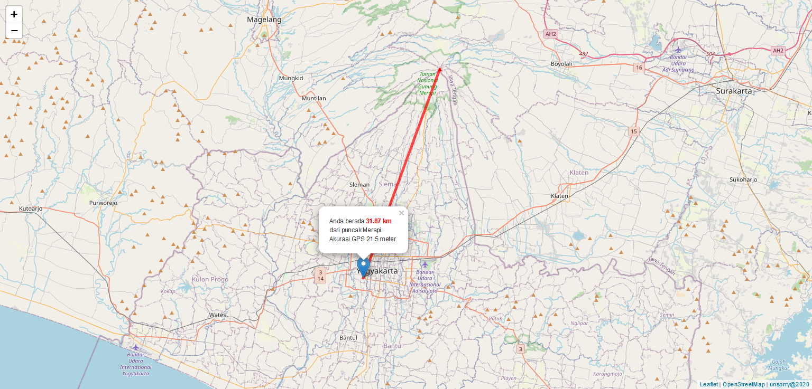

# Jarak dari Merapi dengan Leaflet JS

Menghitung jarak dari puncak merapi dengan jarak lokasi koordinat kita menggunakan leaflet js.

---

**Screenshot:**

---

Demo:

> [Simple](https://anshori.github.io/leaflet-jarakdarimerapi/simple)

> [Menggunakan plugin locate control](https://anshori.github.io/leaflet-jarakdarimerapi/locatecontrol)

---

`unsorry@2020`
